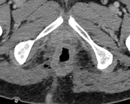
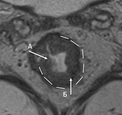
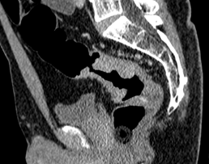

# Введение

Рак ободочной кишки и ректосигмоидного отдела представляет группу
злокачественных опухолей, происходящих из слизистой оболочки толстой
кишки\[@siegel2024cancer\].

Рак прямой кишки (РПК) -- злокачественная опухоль, развивающаяся из
клеток эпителия прямой кишки и локализующаяся в пределах 15 см от ануса
при измерении ригидным ректоскопом\[37\].

Этиология и патогенез. Рак ободочной и прямой кишки в подавляющем
большинстве случаев имеет спорадический характер. Хронические
воспалительные заболевания толстой кишки, включая язвенный колит и
болезнь Крона, повышают риск развития колоректального рака в 2-3
раза\[@eaden2001riskcolorectal\]. Курение увеличивает риск на 18%, а
регулярное употребление алкоголя - на 21%\[@botteri2008smoking\].
Преобладание красного мяса в рационе ассоциировано с повышением риска на
17% на каждые 100 г ежедневного потребления\[@chan2011redprocessed\].
Сахарный диабет 2 типа увеличивает риск в 1,3 раза, а ожирение с ИМТ
\>30 кг/м² - в 1,5 раза\[@larsson2005diabetes\]. У 3--5% пациентов
развитие РПК связано с наследственными синдромами, наиболее
распространенные -- синдром Линча и семейный аденоматоз толстой кишки
\[13, 15, 24, 25, 32\].

Рак прямой кишки и рак ободочной кишки занимают лидирующие позиции по
заболеваемости и смертности от злокачественных опухолей, уступая лишь
раку легкого. В структуре онкологической заболеваемости на их долю
приходится до 5%, а в структуре смертности - 5,7% \[2\].

Следует отметить, что ЗНО, локализованные в прямой и ободочной кишке,
отличаются от образований анального канала своим гистологическим
строением. Рак прямой и ободочной кишки возникает из цилиндрического
эпителия слизистой оболочки и обычно является аденокарциномой, тогда как
рак анального канала возникает из многослойного плоского или переходного
эпителия и представляет собой плоскоклеточный рак (SCC). Поскольку
гистологический тип опухоли указывает на важные различия в биологии
опухоли, определяющие ее ответ на лечение, он является основным
фактором, определяющим выбор метода лечения, независимо от анатомической
локализации.

Рентгенологическое исследование долгое время было единственным методом
визуализации рака прямой и ободочной кишки. Однако, на сегодняшний день,
в нашем арсенале присутствует большой спектр методов позволяющих
визуализировать рак кишки: эндоскопия, эндо-УЗИ, КТ, МРТ, ПЭТ.

На этапе дифференциального диагноза ведущую роль играет эндоскопическое
исследование. Во-первых, в связи с возможностью получить гистологическую
верификацию. Во-вторых, последние достижения эндоскопической техники
значительно повысили ее диагностическую ценность. Конечно, это не
отменяет актуальности дифференциального диагноза с помощью методов
лучевой диагностики, но сильно уменьшает ее клиническое значение.

На методы лучевой диагностики преимущественно возлагается задача оценки
распространенности и исключения метастатического поражения органов
брюшной полости. Для рака ободочной кишки ведущую роль играет КТ
внутривенным контрастированием, в то время как для рака прямой кишки,
золотым стандартом диагностики является МРТ. Данные методы позволяют
оценить и местное распространение опухоли, и выявить метастазы, и
определить другие аспекты влияющие на тактику лечения.

В протоколе КТ или МРТ следует отражать: расстояние от края опухоли до
наиболее близкого анатомического ориентира (купола слепой кишки,
печеночного/селезеночного изгиба или анального отверстия), протяженность
опухоли вдоль кишечной стенки, наличие инвазии в мезоколон и ее глубину,
наличие инвазии в брюшину, наличие лимфатических узлов мезоколона и
забрюшинного пространства с признаками метастатического поражения и их
размеры, наличие отдаленных метастазов, локализованных по брюшине и во
внутренних органах.

Большинство опухолей кишки накапливают ФДГ, что позволяет применять для
его диагностики позитронно-эмиссионную томографию. Однако, малое
пространственное разрешение и чувствительность к артефактам движения
ограничивают возможности метода в визуализации небольших опухолей. Тем
не менее ПЭТ может применятся для поиска отдаленных метастазов.
Поскольку подходы к применению и интерпретации ПЭТ в отношении
метастазов рака желудка не отличаются от метастазов опухолей других
локализаций описание метода не было включено в наше пособие.

Для диагностики раннего рака прямой и ободочной кишки возможно
использование такого метода диагностики как эндо-УЗИ, который имеет
высокую диагностическую эффективность для определения Т1 опухолей и
рекомендуется для отбора пациентов для трансанальной резекции и ТЭМ при
раннем раке прямой кишки.

В нашем методическом пособии мы подробно рассмотрим методику выполнения
и анализа результатов ведущих методов визуализации рака прямой и
ободочной кишки: рентгенологического исследования, КТ, МРТ. Наше пособие
ориентировано на врачей лучевой диагностики и по этой причине в него не
входит описание эндоскопического УЗИ. Это исследование, хоть и является
стандартом оценки раннего рака кишки, по сложившейся практике
выполняется врачами-эндоскопистами без привлечения врачей лучевой
диагностики.

# Методика исследования

### МРТ

Подготовка кишечника направлена на уменьшение артефактов
чувствительности, вызванных воздухом на Т2 и диффузионно-взвешенных
изображениях.

Подготовка к МРТ включает ограничение приема пищи за 4 часа до
исследования для уменьшения перистальтики
кишечника\[@taylor2018magnetic\]. Внутривенное введение спазмолитиков
(дротаверин 80 мг или глюкагон 1 мг) снижает двигательные артефакты при
отсутствии противопоказаний\[@beets2018magnetic\]. Опорожнение мочевого
пузыря за 30-40 минут до исследования минимизирует артефакты движения от
переполненного пузыря\[@lambregts2011magnetic\].

Выполнение очистительной клизмы и эндоректальное контрастирование не
рекомендуются. Было доказано, что перерастяжение стенок кишки приводит к
сокращению истинной толщины мезоректума, что в свою очередь значительно
снижает диагностическую точность МРТ, а очистительная клизма обычно
вызывает раздражение прямой кишки что приводит к повышенной
перистальтике.

### Протокол МРТ таза для оценки местной распространенности рака прямой кишки

Рекомендуется включать в протокол для местного
(первичного/посттерапевтического) стадирования РПК получение следующих
видов изображений:

\- 2D T2-ВИ в 3-х ортогональных плоскостях толщиной не более 4мм:
сагиттальная, аксиальная, корональная с большим полем обзора (FOV).
Сагиттальные серии используются для определения продольной оси опухоли,
оценки её длины и высоты, взаимосвязи с брюшиной и другими соседними
структурами. Сканирование в аксиальной плоскости должно охватывать
область от подвздошных гребней до бугристостей седалищных костей, а в
сагиттальной - всё пространство таза между медиальными краями внутренних
запирательных мышц.

\- косые Т2-ВИ высокого разрешения (FOV 160мм, матрица 256×256) с
толщиной среза не более 3 мм, ориентированные перпендикулярно и
параллельно длинной оси опухоли (рис1.). Они необходимы для оценки
глубины инвазии в пределах стенки кишки, МРФ и прилегающей
мезоректальной клетчатки.

\- ДВИ большим полем обзора минимум с 2-мя значениями b фактора (b=0-50
с/мм^2^ и b=800-1000с/мм^2^) с построением карт измеряемого коэффициента
диффузии (ИКД); опционально дополнительно высокоразрешающие ДВИ с
толщиной среза 3мм перпендикулярно длинной оси опухоли (для оценки
эффективности неоадъювантного лечения).

\- Т2-ВИ высокого разрешения параллельно/перпендикулярно анальному
каналу при низких раках для оценки вовлечения анального сфинктерного
комплекса, для оценки взаимоотношения со сфинктерным аппаратом и
леваторами (рис 2).

\- Т1-ВИ без контрастного усиления рекомендуется SAR для улучшения
визуализации муцинозных опухолей и выявления метастазов в кости. Т1-ВИ с
контрастным усилением и последовательности с динамическим контрастным
усилением (DCE) рутинно не рекомендуются, так как нет доказательств
эффективности их рутинного использования. Однако использование
контрастного усиления настоятельно рекомендует ACR (Американская
коллегия радиологии).

\- Последовательности с подавлением сигнала от жира рутинно не
рекомендуются.

а)МРТ{width="1.2985542432195976in"
height="1.6207524059492564in"} б)МРТ {width="1.4761154855643044in"
height="1.599919072615923in"} и
КТ{width="1.8005205599300087in"
height="1.6079516622922134in"}

в) МРТ
{width="1.6354166666666667in"
height="1.6832524059492564in"} и КТ
{width="1.8889807524059492in"
height="1.6979166666666667in"}

Рис.1. Опухоль среднеампулярного отдела прямой кишки (белые стрелки):

а) Т2-ВИ в сагиттальной плоскости: ориентация срезов высокого разрешения
(линии); б) Т2-ВИ и высокого разрешения и КТ в аксиальной плоскости, в
соответствии с ориентацией срезов на сагиттальном изображении; в) Т2-ВИ
высокого разрешения и КТ в корональной плоскости, в соответствии с
ориентацией срезов на сагиттальном изображении

{width="2.9256944444444444in"
height="3.10625in"}

Рис. 2. МРТ. Опухоль анального канала (белые стрелки). Т2-ВИ в
сагиттальной плоскости. Ориентация срезов высокого разрешения (линии).

## 

# Анатомия прямой кишки

Прямая кишка --- это терминальный отдел пищеварительного тракта,
расположенный дистальнее сигмовидной кишки до уровня анального края,
имеющий длину около 15 см. В клинической практике и при описании
результатов научных исследований рак прямой кишки разделяют на
нижнеампулярный (0--5 см от анокутанной линии), среднеампулярный (5--10
см от анокутанной линии), верхнеампулярный (10--15 см от анокутанной
линии). Ректоксигмоидный отдел имеет протяженность около 2 см,
локализуясь проксимальнее верхнеампулярного \[37\].

## Строение стенки

Стенка прямой кишки состоит из трех слоев, которые можно визуализировать
на МРТ на Т2-ВИ высокого разрешения (ВР-МРТ) (рис. 1). Самый внутренний,
слизистый слой, представлен в виде тонкой гипоинтенсивной полоски.
Средний -- подслизистый, имеет гиперинтенсивный МР-сигнал. Внешний,
мышечный слой, состоит из внутреннего циркулярного и наружного
продольного пучков мышц. Обычно слои мышечной оболочки дифференцировать
не удаётся, и они визуализируются как один слой в виде
изо-гипоинтетенсивного МР-сигнала, имеющего четкую границу с
мезоректальной клетчаткой.

а){width="3.048649387576553in"
height="2.180706474190726in"}

б) {width="2.3604166666666666in"
height="2.629861111111111in"}в){width="3.0220374015748033in"
height="2.6016786964129484in"}

Рис. 1 -- а) Анатомическое строение стенки прямой кишки: МРТ (Т2-ВИ) в
аксиальной плоскости; б) - гистологический микропрепарат стенки кишки.
Стрелками указаны слои стенки кишки: (А) -- слизистый слой, (Б) --
подслизистый слой, (В) -- мышечный слой; в) -- КТ в аксиальной
плоскости. Стрелками указаны слои стенки кишки: (А) -- слизистый слой,
(Б) -- мышечный слой.

## Отношение к брюшине.

Прямая кишка имеет серозную оболочку только выше уровня переходной
складки брюшины, вдоль передней и боковых поверхностей в верхней трети и
передней поверхности в средней трети прямой кишки.

Переходная складка брюшины четко визуализируется на Т2-ВИ в сагиттальной
и аксиальной проекциях в виде линии, идущей от задней поверхности
семенных пузырьков (у мужчин), шейки или тела матки (у женщин) к
передней поверхности кишечной стенки (Рис. 2а). На аксиальных срезах она
определяется в виде V-образной тонкой гипоинтенсивной линии (Рис. 2б).
Ниже уровня переходной складки брюшины прямая кишка окружена
мезоректальной клетчаткой, которая ограничена тонкой МРФ, сливающейся с
фасцией Денонвилье или ретровагинальной фасцией кпереди и пресакральной
фасцией кзади.

а) {width="2.4122287839020125in"
height="2.5218755468066494in"} б)
{width="2.700016404199475in"
height="2.535269028871391in"}

в){width="2.84375in"
height="2.0520833333333335in"}
г){width="2.7708333333333335in"
height="2.089909230096238in"}

Рис. 2 -- МРТ, Т2-ВИ в сагиттальной (а) и аксиальной (б) плоскостях; КТ
в сагиттальной (в) и . Переходная складка тазовой брюшины (белая
стрелка).

## Мезоректальная фасция.

МРФ полностью окружает прямую кишку только в нижней трети, представляет
собой тонкий фасциальный футляр, отграничивающий прямую кишку и
окружающую её жировую клетчатку с параректальными сосудами и
лимфатическими коллекторами (Рис. 3). На Т2-ВИ она визуализируется в
виде гипоинтенсивной циркулярной линии. Книзу МРФ истончается и
соприкасается с внутренней поверхностью m. levator ani, сливается с
фасцией таза.

**Пресакральная фасция** -- это задняя часть париетального листка фасции
таза, которая отграничивает пресакральную клетчатку, а также
расположенные в ней пресакральные вены и сплетения.

а) {width="2.6895570866141734in"
height="2.2772900262467193in"} б)
{width="2.6961843832020995in"
height="2.2709798775153107in"}

Рис. 3 -- а) МРТ, Т2-ВИ в аксиальной плоскости на уровне
среднеампулярного отдела прямой кишки. б) макропрепарат
послеоперационного материала. Мезоректальная фасция (белые стрелки).

ф) {width="2.806299212598425in"
height="2.219207130358705in"}
б){width="2.673015091863517in"
height="2.2509601924759406in"}

Рис. 4. -- а) КТ (жен.) в аксиальной плоскости на уровне
среднеампулярного отдела прямой кишки (белые стрелки) б) КТ (муж.) в
аксиальной плоскости на уровне верхнеампулярного отдела прямой кишки
(белые стрелки)

M.levator ani -- парная мышца, состоящая из mm. puborectalis,
pubococcygeus, illeococcygeus и lig. anococcygeus (фиброзной связки).

**Анальный канал** -- дистальный отдел прямой кишки. Его верхней
границей является зубчатая линия (переход многослойного плоского
неороговевающевого эпителия анального канала в однослойный
цилиндрический или кубовидный эпителий слизистой оболочки прямой кишки),
ей анатомически соответствует уровень верхнего края m. puborectalis,
которая окружает прямую кишку на уровне перехода леваторов в наружный
сфинктер анального канала в виде петли (рис. 4).

а) {width="2.62669072615923in"
height="2.844792213473316in"} б)
{width="2.804183070866142in"
height="2.860492125984252in"}

Рис. 4 -- ВР-МРТ, Т2-ВИ по длинной оси анального канала -- Cor плоскость
(а), и короткой оси -- Ax плоскость (б). M. puborectalis (белая
стрелка). Пунктирная линия -- её верхний край, проекция зубчатой линии,
дистального края прямой кишки.

Анальный канал состоит из двух сфинктеров и межсфинктерного пространства
(рис. 5). Внутренний сфинктер является продолжением циркулярных мышечных
волокон мышечного слоя нижнеампулярного отдела прямой кишки, наружный
сфинктер представлен поперечно-полосатыми мышечными волокнами.

а) {width="3.4319444444444445in"
height="2.5868055555555554in"}

б) {width="2.3305883639545057in"
height="2.5822911198600176in"} в)
{width="2.7663396762904635in"
height="2.4906255468066494in"}

Рис. 5 -- Анатомия анального канала. а) -- схематичное изображение
\[39\]

б) ВР-МРТ, Т2-ВИ по длинной оси анального канала, в) ВР-МРТ, Т2-ВИ по
короткой оси анального канала. Белые стрелки: а) наружный сфинктер; б)
внутренний сфинктер; в) межсфинктерное пространство.

Анальный канал заканчивается анальным краем --- это граница, где
дистальная граница анального канала достигает поверхности кожи, переход
эпителия анального канала в многослойный ороговевающий эпителий
перианальной кожи.

# Выявление опухоли

Рак кишки может быть визуализирован с помощью всего спектра методов
лучевой диагностики. Чувствительность методов зависит от размеров и
стадии опухоли. При выявлении рака кишки на поздних стадиях
диагностическая эффективность методов практически эквивалентна. Однако,
при выявлении ранних форм рака кишки эндоскопическое исследование
превосходит все методы лучевой диагностики. Исключение составляют
эндофитные формы рака кишки. Скиррозные (диффузные) формы рака кишки
могут иметь относительно нормальную эндоскопическую картину, но хорошо
видны с помощью методов лучевой диагностики.

Тем не менее вопрос выявления опухоли является крайне важным для
рентгенолога, так как методы лучевой диагностики активно применяются в
оценке распространения и топографии опухоли.

## **Классификация**

Патологоантомический отчет при колоректальном раке включает в себя
важные гистологические особенности и диагностические критерии в
соответствии с международными отчетами на основе 5 издания классификации
ВОЗ «Опухоли пищеварительной системы»:

-   гистологический подтип

-   степень дифференцировки: низкая / высокая

-   глубина инвазии: в соответствии с TNM, указать, если инвазия в
    другие органы (pT4) или перфорация опухоли

-   наличие (лимфо) сосудистой инвазии: интрамуральная сосудистая
    инвазия, экстрамуральная сосудистая инвазия, лимфатическая инвазия

-   периневральный рост: присутствует / отсутствует

-   состояние края резекции (проксимальное, дистальное, циркулярный
    CRM): положительный, отрицательный, хирургический клиренс
    (расстояние в мм).

-   локализация, максимальный размер опухоли

-   оценка качества TME

-   количество исследованных лимфатических узлов (12). Количество
    положительных лимфатических узлов

-   TRG наличие ответа на лечение

-   микросателлитный статус / наличие белков, восстанавливающих
    несоответствие ДНК (MLH1, MSH2, MSH6, PMS2): микросателлитно -
    стабильный pMMR/MSS или нестабильный dMMR/MSI

-   Tumour budding статус

-   иммунная реакция

**Гистопатология**

Большинство (90%) колоректальных карцином являются аденокарциномами. Их
отличительная черта **-** инвазия через мышечную пластинку слизистой
оболочки в подслизистую основу. В отличии, например, от нейроэндокринной
опухоли, которая чаще локализуется в подслизистой основе кишки и
выявляется, как полиповидый узелок при эндоскопии. В большинстве случаев
колоректальная аденокарцинома диагностируется как неспецифицированная
(NOS). Макроскопический вид таких карцином вариабельный, с эндофитными и
экзофитными типами роста и различной степенью фиброза. Чаще всего это-
язва с закругленными краями, распространяющуюся циркулярно по окружности
толстой кишки. Кроме того, выделяют и несколько гистопатологических
подтипов со специфическими клиническими и молекулярными
характеристиками.

**Муцинозная аденокарцинома 8480/3**

Опухоль определяется как **муцинозная аденокарцинома**, если \> 50%
опухоли состоит из **внеклеточного** муцина, который содержит
злокачественный эпителий в виде железистых структур или единичных
клеток, включая перстневидные клетки. Распространенность от 5% до 20%.
Нет никакой прогностической разницы по сравнению с аденокарциномой БДУ,
хотя при метастазах наблюдается относительно плохой ответ на системное
лечение. Grade определяется по наличию железистого компонента и степени
дифференцировки эпителия хотя в предыдущей классификации ВОЗ муцинозные
аденокарциномы считали низкодифференцированными (G3)

{width="3.722916666666667in"
height="2.2055555555555557in"}

муцинозная аденокарцинома

Карциномы, содержащие муцин \<50% определяются как аденокарциномы **с
муцинозным компонентом.**

{width="3.6277777777777778in"
height="2.1486111111111112in"}

аденокарциномы с муцинозным компонентом

**Перстневидно-клеточная карцинома 8490/3**

Опухоль определяется как перстневидно-клеточная карцинома, если \> 50%
опухолевых клеток являются перстневидными (имеют выраженный
внутрицитоплазматический муцин, смещенное к периферии ядро). Этот подтип
имеет низкий уровень распространенности, примерно 1%, и склонность к
поражению правых отделов толстой кишки, часто выявляются на поздних
стадиях. Исход с поправкой на стадию хуже по сравнению с аденокарциномой
NOS и муцинозной карциномой. Метастазы развиваются быстро и во
множественных локализациях, что нетипично для CRC. Карциномы с
перстневидными клетками в \< 50% опухоли классифицируются как имеющие
перстневидно-клеточный компонент.

{width="3.31875in"
height="1.9659722222222222in"}
{width="3.3194444444444446in"
height="1.9659722222222222in"}

{width="3.31875in"
height="1.9659722222222222in"}
{width="3.234027777777778in"
height="1.9152777777777779in"}

перстневидноклеточная карцинома

**Карцинома из плохо сцепленных клеток (poorly cohesive carcinoma)
8490/3**

Карцинома из плохо сцепленных клеток состоят из изолированных или групп
неопластических клеток, напоминающих гистиоциты или лимфоциты, не
формирует желез, может содержать перстневидные клетки. Эти карциномы
могут демонстрировать выраженный клеточный полиморфизм и
десмопластическую реакцию стромы.

{width="3.0319444444444446in"
height="1.9111111111111112in"}

Карцинома из плохо сцепленных клеток

**Медуллярная карцинома 8510/3**

Этот подтип характеризуется пластами злокачественных клеток с
везикулярными ядрами, выраженными ядрышками и обильной эозинофильной
цитоплазмой, демонстрирует выраженную инфильтрацию лимфоцитами и
нейтрофильными гранулоцитами. Распространенность - 4%. В реестрах рака
этот подтип занижен. Этот подтип в большинстве случаев ассоциирован с
MSI, чаще всего в сочетании с мутациями *BRAF*, и имеет хороший прогноз.
Следует отметить, что этот тип CRC демонстрирует аберрантную
иммуногистохимическую картину с потерей CDX2 и CK20. Нейроэндокринные
маркеры при иммуногистохимии отрицательные.

{width="2.9097222222222223in"
height="1.7229166666666667in"}
{width="3.2444444444444445in"
height="1.7048611111111112in"}

медуллярная карцинома

**Зубчатая аденокарцинома 8213/3**

Этот подтип определяется морфологическим сходством с зубчатыми полипами,
содержит железистые структуры с зубчатыми изменениями эпителия.
Опухолевые клетки имеют низкое ядерно-цитоплазматическое соотношение
(low grade дисплазию эпителия). Приблизительно 10--15% всех CRC можно
классифицировать как зубчатую аденокарциному.

{width="2.819291338582677in"
height="1.6181102362204725in"}

зубчатая аденокарцинома

**Аденомоподобная аденокарцинома (Adenoma-like adenocarcinoma) 8262/3**

Этот подтип, ранее описанный как «ворсинчатая аденокарцинома» и
«инвазивная папиллярная аденокарцинома», определяется как инвазивная
аденокарцинома, в которой ≥ 50% инвазивных областей имеют
аденомоподобный вид с ворсинчатыми структурами, с low grade дисплазией
эпителия. Наблюдается минимальная десмопластическая реакция стромы и "
отодвигающий" характер роста (pushing growth pattern). Частота
распространения от 3% до 9%. Этот подтип характеризуется трудностями в
установлении диагноза инвазивного компонента по биоптатам, высокой
частотой мутаций KRAS и благоприятным прогнозом.

{width="3.042361111111111in"
height="1.801388888888889in"}
{width="3.1598425196850393in"
height="1.7452755905511812in"}{width="2.53125in"
height="2.040277777777778in"}

"аdenoma-like" аденокарцинома

**Микропапиллярная аденокарцинома 8265/3**

Этот подтип характеризуется небольшими скоплениями опухолевых клеток в
стромальных пространствах, имитирующих сосудистые каналы; ≥ 5% опухоли
должны иметь этот аспект для постановки данного диагноза. Его частота
колеблется от 5% до 20%. Этот подтип имеет высокий риск метастазирования
в лимфатические узлы и часто присутствуют неблагоприятные
прогностические факторы, такие как лимфатическая инвазия,
экстрамуральная сосудистая инвазия (EMVI) и периневральная инвазия.

**Аденосквамозная карцинома 8560/3**

Этот редкий подтип с частотой \<0,1% имеет морфологические признаки
аденокарциномы и плоскоклеточной карциномы.

**Карциномы с саркоматоидными компонентами 8033/3**

Небольшая подгруппа CRC характеризуется участками недифференцированной
опухоли и участками с саркоматоидным компонентом с наличием
веретенообразных клеток. В целом у пациентов плохой прогноз. Опухоли,
как правило, большие по размеру.

**Недифференцированная карцинома 8020/3**

У этих карцином отсутствуют морфологические, иммуногистохимические и
молекулярные признаки эпителиальной дифференцировки. Они отличаются от
медуллярных карцином отсутствием отодвигающего инвазивного края,
выраженного лимфоплазмоцитарного инфильтрата. Редко ассоциированы с MSI.

{width="2.8722222222222222in"
height="1.7013888888888888in"}

недифференцированная карцинома

**Grade**

Grade колоректальной карциномы (CRC) определяется по соотношению
железистого компонента и наименее дифференцированного компонента (по
преобладающему компоненту): Low grade (ранее G1 и G2) и high grade
(ранее G3) опухоли. Инвазивный фронт, где формируется tumor budding и
скопления низкодифференцированных клеток как признак
эпителиально-мезенхимального перехода, не следует принимать во внимание
при определении Grade, но о нем следует сообщать отдельно.

{width="3.125in"
height="1.851388888888889in"}
{width="3.1319444444444446in"
height="1.854861111111111in"}

аденокарцинома high grade

{width="3.26875in"
height="1.9361111111111111in"}

аденокарцинома low grade

## 

# Стадирование рака прямой кишки

Стадирование --- важнейший этап диагностики, позволяющий оценить
распространённость опухоли и определить тактику лечения. Оно влияет на
стратификацию пациентов, выбор объёма операции и показания к
неоадъювантной терапии.

Особая важность стадирования обусловлена тем, что на момент первичной
диагностики пациенты могут иметь как локализованные формы заболевания,
так и отдалённые метастазы, что кардинально меняет лечебный подход ---
от малоинвазивных и сфинктеросохраняющих операций до неоадъювантной
химиолучевой терапии.

Ключевое значение имеет и точная анатомическая локализация опухоли: она
определяет хирургический доступ, возможность выполнения резекций и
сохранения сфинктера. Критичными являются расстояние до зубчатой линии и
расположение относительно переходной складки тазовой брюшины. Для
опухолей нижнеампулярного отдела необходимо уточнение инвазии в
сфинктерный аппарат, m. levator ani, что позволяет определить
возможность выполнения межсфинктерной резекции. Вовлечение
мезоректальной фасции, поражение лимфоузлов и наличие экстрамуральной
венозной инвазии (EMVI) определяет необходимость расширенных
вмешательств, включая латеральную лимфодиссекцию, и объём лучевой
терапии.

Определение морфологических особенностей образования, например
муцинозная структура или перстневидноклеточный рак, позволяют
предположить потенциально худший прогноз, в связи с большим риском
метахронных метастазов и худшим ответом на химиолучевую терапию.

Таким образом, качественное стадирование и точная топографическая оценка
формируют основу персонализированного лечения, снижая риск рецидива и
повышая шансы на функционально щадящую хирургию или безоперационное
ведение пациента.

## Оценка местной распространенности

#### Общие принципы лучевой диагностики

Стадирование злокачественных новообразований толстой и прямой кишки
основано на международной классификация злокачественных новообразований
объединенного американского комитета по раку (The American Joint
Committee on Cancer, AJCC) и Союза международного контроля над раковыми
заболеваниями (Union for International Cancer Control, UICC) (8-е
издание UICC, 2017) (табл. 1) \[5\].

В её рамках опухоли классифицируются по трём категориям:

-   **T (tumor)** -- степень инвазии первичной опухоли в стенку кишки и
    за её пределы,

-   **N (nodes)** -- наличие и число метастатически поражённых
    регионарных лимфатических узлов,

-   **M (metastasis)** -- наличие отдалённых метастазов.

**Таблица 1** Классификация РПК по системе TNM

+-----------+------------------------------------+---------------------+
| > **Ка    | > **Описание**                     | > **Дополнительные  |
| тегория** |                                    | > подклассификации  |
|           |                                    | > с использованием  |
|           |                                    | > лучевых методов   |
|           |                                    | > диагностики**     |
+===========+====================================+=====================+
| > **TX**  | > недостаточно данных для оценки   |                     |
|           | > первичной опухоли                |                     |
+-----------+------------------------------------+---------------------+
| > **Tis** | > преинвазивный рак                |                     |
|           | > (интраэителиальная инвазия или   |                     |
|           | > инвазия собственной пластинки    |                     |
|           | > слизистой оболочки).             |                     |
+-----------+------------------------------------+---------------------+
| > **T1**  | > опухоль распространяется в       | > Подклассификация  |
|           | > подслизистый слой стенки кишки   | > по Kikuchi^1^     |
|           |                                    | >                   |
|           |                                    | > **T1sm1** --      |
|           |                                    | > глубина инвазии   |
|           |                                    | > подслизистого     |
|           |                                    | > слоя до 1/3       |
|           |                                    | >                   |
|           |                                    | > **T1sm2** --      |
|           |                                    | > глубина инвазии   |
|           |                                    | > подслизистого     |
|           |                                    | > слоя до 2/3       |
|           |                                    | >                   |
|           |                                    | > **T1sm3** --      |
|           |                                    | > полная инвазия    |
|           |                                    | > опухолью всего    |
|           |                                    | > подслизистого     |
|           |                                    | > слоя              |
+-----------+------------------------------------+---------------------+
| > **T2**  | > опухоль распространяется на      |                     |
|           | > мышечный слой                    |                     |
+-----------+------------------------------------+---------------------+
| > **T3**  | > врастание в субсерозу или        | > Подклассификация  |
|           | > неперитонизированную             | > ^2^:              |
|           | > околокишечную клетчатку          | >                   |
|           |                                    | > **T3a --**        |
|           |                                    | > инвазия в         |
|           |                                    | > мезоректальную    |
|           |                                    | > клетчатку менее 1 |
|           |                                    | > мм                |
|           |                                    | >                   |
|           |                                    | > **T3b** **--**    |
|           |                                    | > инвазия в         |
|           |                                    | > мезоректальную    |
|           |                                    | > клетчатку 1-5 мм  |
|           |                                    | >                   |
|           |                                    | > **T3c --**        |
|           |                                    | > инвазия в         |
|           |                                    | > мезоректальную    |
|           |                                    | > клетчатку 5-15 мм |
|           |                                    | >                   |
|           |                                    | > **T3d --**        |
|           |                                    | > инвазия в         |
|           |                                    | > мезоректальную    |
|           |                                    | > клетчатку более   |
|           |                                    | > 15 мм             |
+-----------+------------------------------------+---------------------+
| > **T4**  | > опухоль прорастает в окружающие  |                     |
|           | > органы и ткани или серозную      |                     |
|           | > оболочку при локализации в       |                     |
|           | > верхнеампулярном отделе прямой   |                     |
|           | > кишки                            |                     |
+-----------+------------------------------------+---------------------+
| > **T4a** | > прорастание висцеральной брюшины |                     |
+-----------+------------------------------------+---------------------+
| > **T4b** | > прорастание в другие органы и    |                     |
|           | > структуры^3,4^                   |                     |
+-----------+------------------------------------+---------------------+
| >         |                                    |                     |
| Состояние |                                    |                     |
| > ре      |                                    |                     |
| гионарных |                                    |                     |
| > лимф    |                                    |                     |
| атических |                                    |                     |
| > узлов   |                                    |                     |
+-----------+------------------------------------+---------------------+
| > **Nх**  | > Недостаточно данных для оценки   |                     |
+-----------+------------------------------------+---------------------+
| > **N0**  | > Признаков поражения регионарных  |                     |
|           | >                                  |                     |
|           | > лимфатических узлов нет          |                     |
+-----------+------------------------------------+---------------------+
| > **N1**  | > Метастазы в 1--3 (включительно)  |                     |
|           | > регионарных лимфатических узлах  |                     |
+-----------+------------------------------------+---------------------+
| > **N1a** | > метастазы в 1 регионарном        |                     |
|           | > лимфатическом узле               |                     |
+-----------+------------------------------------+---------------------+
| > **N1b** | > метастазы в 2--3 лимфатических   |                     |
|           | > узла                             |                     |
+-----------+------------------------------------+---------------------+
| > **N1c** | > диссеминаты в брыжейке без       |                     |
|           | > поражения регионарных            |                     |
|           | > лимфатических узлов              |                     |
+-----------+------------------------------------+---------------------+
| > **N2**  | > Метастазы в более чем 3-х        |                     |
|           | > регионарных лимфатических узлах  |                     |
+-----------+------------------------------------+---------------------+
| > **N2a** | > поражено 4--6 лимфатических      |                     |
|           | > узлов                            |                     |
+-----------+------------------------------------+---------------------+
| > **N2b** | > поражено 7 и более лимфатических |                     |
|           | > узлов                            |                     |
+-----------+------------------------------------+---------------------+
| > О       |                                    |                     |
| тдаленные |                                    |                     |
| >         |                                    |                     |
| метастазы |                                    |                     |
+-----------+------------------------------------+---------------------+
| > **М0**  | > отдаленных метастазов нет        |                     |
+-----------+------------------------------------+---------------------+
| > **М1**  | > наличие отдаленных метастазов    |                     |
+-----------+------------------------------------+---------------------+
| > **М1а** | > наличие отдаленных метастазов в  |                     |
|           | > одном органе                     |                     |
+-----------+------------------------------------+---------------------+
| > **M1b** | > наличие отдаленных метастазов    |                     |
|           | > более чем в одном органе         |                     |
+-----------+------------------------------------+---------------------+
| > **M1c** | > метастазы по брюшине             |                     |
+-----------+------------------------------------+---------------------+

*^1^ -- при планировании местного иссечения Т1 рака прямой кишки
проводится детальное подстадирование на основе данных ТРУЗИ. \[16\]*

*^2^ -- для персонализации показаний к неоадъювантному лечению Т3 рака
прямой кишки проводится детальная оценка глубины экстрамурального
распространения опухоли на основе МРТ.*

Итоговая стадия заболевания определяется на основе комбинации этих
параметров и может обозначаться как буквенно-цифровым кодом (например,
cT3N1M0), так и как интегральная стадия (I, II, III, IV), отражающая
прогноз.

Стадия может быть зафиксирована в разные моменты лечения:

-   **Клиническая стадия** (сTNM) -- устанавливается до начала лечения
    по результатам неинвазивных методов, включая МРТ и эндоскопию.

-   **Инструментальная стадия** (iTNM) -- подтип клинической, когда
    стадирование выполняется с помощью методов визуализации.

-   **Патоморфологическая стадия** (pTNM) -- определяется после
    хирургического вмешательства и гистологического анализа препарата.

-   **Посттерапевтическая стадия** (yTNM) -- используется после
    проведения химио- или лучевой терапии, включает ycTNM (клиническая
    после терапии) и ypTNM (патоморфологическая после терапии).

Принципиально важно, что клиническая стадия не должна пересматриваться
на основании данных, полученных после начала специфического лечения. Это
правило поддерживает корректность клинических исследований и
сопоставимость результатов терапии.

Первым этапом при оценке локализации необходимо определить анатомический
отдел опухоли прямой кишки, на уровне которого определяется образование.

Для этого измеряется расстояние до дистального края опухоли (рис. 3):

-   от анального края,

-   от уровня m. puborectalis (зубчатой линии\\аноректального угла),
    соответствующего верхней границе хир**у**ргического анального канала
    (рис. 4).

{width="2.5416666666666665in"
height="2.7604166666666665in"}

Рис. 3. Измерение расстояние от нижнего края опухоли до анального края
(дистального края внутреннего сфинктера) проводят на Т2-ВИ в
сагиттальной плоскости вдоль центра просвета кишки по прямой, кривой или
ломаной линии (опухоль отмечена стрелками).

{width="4.291666666666667in"
height="2.5416666666666665in"}

Рис. 4. Измерение расстояния от нижнего края опухоли до верхнего края
хирургического анального канала (аноректального угла/ верхнего края
пуборектальной мышцы): а) на Т2ВИ в сагиттальной плоскости (верхний край
анального канала - сплошная линия; расстояние до нижнего полюса опухоли
-- пунктирная линия, опухоль -- черные стрелки); б) на Т2ВИ в коронарной
плоскости верхний край анального канала -- сплошная линия, верхний край
пуборектальной мышцы -- головки стрелок.

При этом опухоли, расположенные выше 15 см от анального края,
рассматриваются как рак ободочной кишки (15-17 см ректосигмоидный отдел)
\[36\].

Вторым этапом шагом является оценка протяжённости опухоли и её
распространения по окружности, которое описывается в условных «часах
циферблата». Опухоль прямой кишки обычно проявляется в виде локального
утолщения стенки кишки с закругленными приподнятыми краями. (рис. 10)
При описании важно определить наиболее инвазивную часть опухоли
(опухолевую площадку), соответствующую области самой глубокой
инфильтрации, которая обычно расположена в центральных отделах опухоли.
Ряд сложностей вызывает оценка глубины распространения за пределы
кишечной стенки при раке нижнеампулярного отдела, в первую очередь из-за
сужения (истончения) мезоректальной клетчатки. Эти характеристики
позволяют уточнить потенциальную резектабельность, риск и уровень
инвазии МРФ.

а) {width="2.5520833333333335in"
height="2.3958333333333335in"}б)
{width="2.8333333333333335in"
height="2.3958333333333335in"}

Рис. 10 -- Опухоль среднеампулярного отдела прямой кишки.

а) МРТ, Т2-ВИ в аксиальной плоскости. б) Эндоскопическое исследование.
Белые стрелки: А) -- закругленный край опухоли; Б) опухолевая площадка.
Пунктирная линия -- полуокружность опухоли.

Следующим шагом рекомендуется определять локализацию опухоли
относительно переходной складки брюшины (полностью ниже/ на уровне/
полностью выше) в сагиттальных и/или аксиальных плоскостях. (рис. 5)
Нижняя точка переходной складки брюшины определяется на передней стенке
кишки, дальше линия прикрепления брюшины уходит косо вверх, его уровень
сзади чаще всего располагается на 1--4 см ниже S1--S2 и визуализировать
его сложно \[36\].

{width="4.927083333333333in"
height="2.5208333333333335in"}

Рис. 5. Верхний полюс опухоли на уровне переходной складки брюшины
(отмечен стрелкой) на сагиттальном (а) и аксиальном Т2-ВИ (б).

При описании опухоли необходимо указывать морфологическую картину
опухоли (полиповидную, полуциркулярную/субциркулярную/циркулярную), и ее
структуру (если опухоль имеет жидкостные включения - [муцинозную, или
с]{.mark} перстневидноклеточным компонентом (рак с диффузным типом
роста), обычно локализующийся в подслизистом слое без изменения
слизистого.

**[а)]{.mark}**
{width="2.5833333333333335in"
height="2.8125in"} **[б)]{.mark}**
{width="2.8611001749781275in"
height="2.672346894138233in"}

**[в)]{.mark}**
{width="3.0104166666666665in"
height="2.5in"}

**[Рис. 9 -- Муцинозная опухоль прямой кишки.]{.mark}**

[(а) - Т2-ВИ в сагиттальной плоскости. Муцинозная опухоль прямой кишки
(тонкие стрелки). (б) -- Т2-ВИ в аксиальной плоскости. Метастатически
пораженный муцинозный ЛУ (толстая стрелка). (в) -- макропрепарат
послеоперационного материала. Метастатически пораженный муцинозный ЛУ
(толстая стрелка).]{.mark}

Для низких опухолей прямой кишки, расположенных в пределах ≤5 см от
анального края, была предложена специализированная система стадирования
\[6, 26, 28\], которая учитывает анатомические особенности и позволяет
точнее планировать оперативное лечение (например, меж\\интерсфинктерную
резекцию или брюшнопромежностную экстерпацию (БПЭ)), однако её
применение является преимущественно прерогативой МРТ.

#### МРТ

МРТ является методом выбора при клиническом стадировании рака прямой
кишки в связи с её высокой точностью в оценке как локальной
распространенности (T-критерий), так и вовлеченности мезоректальной
фасции (MRF), лимфатических узлов (N), и наличия признаков венозной
инвазии (EMVI) \[4, 7\]. В частности, тонкосрезовая высокоразрешающая
ВР-МРТ позволяет визуализировать анатомические детали, значимые для
хирургического планирования, в том числе оценку потенциального CRM
(циркулярного края резекции).

Магнитно-резонансная томография предоставляет уникальные возможности для
анатомически точной оценки локализации и распространённости опухоли.
Стандартом является выполнение высокоразрешающей T2-взвешенной
томографии в двух (опционально в трёх) проекциях:

1.  **Сагиттальная проекция** -- для оценки протяжённости, положения
    относительно зубчатой линии (уровня верхнего края m. puborectalis),
    и переходной складки брюшины.

2.  **Косо-аксиальная проекция, перпендикулярная длинной оси опухоли**
    -- для оценки глубины инвазии стенки и клетчатки.

3.  **Корональная проекция по длинной оси анального канала** -- при
    опухолях нижнего уровня, с целью визуализации сфинктерного
    комплекса.

**Морфологические характеристики опухоли**

МРТ обладает широкими возможностями в оценке морфологических
особенностей опухоли, поэтому крайне важно отражать эти изменения в
заключении.

Одной из ключевых характеристик является наличие муцинозного компонента.
Муцинозные опухоли демонстрируют высокую интенсивность сигнала на Т2-ВИ,
что позволяет достоверно их идентифицировать при МРТ-исследовании (Рис.
9).

Кроме того, существуют опухоли с перстневидноклеточным компонентом (рак
с диффузным типом роста). Эти образования часто локализуются в
подслизистом слое, из-за чего могут оставаться незамеченными при
эндоскопии. При этом опухолевая инвазия нередко распространяется в более
глубокие слои стенки кишки, недоступные при выполнении стандартных
«поверхностных» биопсий ([Рис. \...]{.mark}).

Важно подчеркнуть, что несмотря на то, что окончательная верификация
опухоли осуществляется гистологически, муцинозные образования хорошо
визуализируются при МРТ --- зачастую с большей диагностической
эффективностью, чем при биопсии (Рис. 10) \[33, 34\].

Обязательно указываются следующие признаки:

-   **Тип роста**: полиповидный, полуциркулярный, циркулярный. (рис. 9);

-   **Тип сигнала на Т2-ВИ** -- особенно важно при **муцинозных
    опухолях**, которые характеризуются гиперинтенсивным сигналом на
    Т2-ВИ и хуже поддаются химиолучевому лечению;

-   **Ворсинчатые образования** могут сопровождаться скоплением слизи в
    просвете кишки;

-   **Опухоли с перстневидноклеточным компонентом** (рак с диффузным
    типом роста), часто демонстрируют изо- или гипоинтенсивный сигнал на
    Т2-ВИ, диффузное вовлечение стенок и мезоректальной клетчатки по
    типу "карциноматоза".

Благодаря высокой тканевой контрастности МРТ позволяет выявлять даже
минимальные изменения и отличать опухоль от вторичных воспалительных
реакций.

#### Особенности при низком расположении

Прицельные высокоразрешающие срезы Т2-ВИ в корональной плоскости (по
длинной оси) позволяют подробно описать распространенность процесса,
необходимую для определения хирургического подхода.

В ряде случаев, при описании распространенности опухолевого процесса,
рекомендуется дополнительно применять классификацию для стадирования
низкорасположенных опухолей (табл. 2)., что имеет критическое значение
для определения показаний к межсфинктерной резекции или БПЭ, в которой
учитывается вовлечение:

-   сфинктера (внутреннего, наружного)

-   межсфинктерного пространства

-   m\. levator ani

-   расстояние до кожи промежности и m. puborectalis.

**Таблица 2.** МРТ классификация низкого рака ПК \[26, 28\]

+--------------------+-------------------------------------------------+
| > [Стадия 1        | > [опухоль ограничена стенкой кишки и не        |
| > (]{.mark}mrLR1)  | > распространяется на анальный сфинктерный      |
|                    | > комплекс]{.mark}                              |
+====================+=================================================+
| > Стадия 2 (mrLR2) | > опухоль распространяется на внутренний        |
|                    | > сфинктер анального канала, но не              |
|                    | > инфильтрирует межсфинктерное пространство     |
+--------------------+-------------------------------------------------+
| > Стадия 3 (mrLR3) | > опухоль распространяется в межсфинктерное     |
|                    | > пространство или находится на расстоянии не   |
|                    | > менее 1 мм от мышцы, поднимающей задний       |
|                    | > проход                                        |
+--------------------+-------------------------------------------------+
| > Стадия 4 (mrLR4) | > опухоль вовлекает наружный сфинктер анального |
|                    | > канала и инфильтрирует или распространяется   |
|                    | > за пределы мышцы, поднимающей задний проход,  |
|                    | > с прорастанием или без прорастания соседних   |
|                    | > структур                                      |
+--------------------+-------------------------------------------------+

#### КТ

[текст?]{.mark}

## 

## Т-стадирование

Оценка глубины инвазии опухоли (T-категория) --- один из ключевых
параметров при стадировании рака прямой кишки. Именно она определяет
возможность радикального хирургического вмешательства, необходимость
проведения неоадъювантной химиолучевой терапии (ХЛТ) и прогноз
локального контроля. Например, при опухолях с глубокой инвазией в
мезоректальную клетчатку (Т3с--d), поражением брюшины (T4a) или инвазией
в соседние органы (T4b) значительно возрастает риск местного рецидива и
отдалённого метастазирования. Кроме того, градация внутри Т3-категории
по глубине экстрамуральной инвазии позволяет более точно прогнозировать
течение болезни и дифференцировать показания к ХЛТ.

#### Общие принципы лучевой диагностики

T-категория в классификации TNM отражает степень инвазии опухоли в
стенку прямой кишки и окружающие ткани:

-   **T1** --- инвазия ограничена подслизистым слоем;

-   **T2** --- инвазия до мышечного слоя;

-   **T3** --- выход за пределы мышечной оболочки в мезоректальную
    клетчатку;

-   **T4a** --- инвазия висцеральной брюшины;

-   **T4b** --- инвазия в соседние органы и структуры (мочевой пузырь,
    влагалище, матка, крестец и др.).

Для Т1-опухолей используется дополнительная классификация прорастания
опухоли в подслизистый слой (submucosa --- sm), с выделением подгрупп
sm1--sm3 (по Kikuchi и соавт.) \[16\], которая коррелирует с риском
лимфогенного метастазирования.

Т1sm1 -- (поверхностная подслизистая инвазия) опухоль прорастает до 1/3
подслизистого слоя (на глубину 200--300 мкм)

Т1sm2 -- (промежуточный уровень подслизистой инвазии) до 2/3
подслизистого слоя

T1sm3 -- (глубокая подслизистая инвазия) инфильтрация опухолью всей
толщины подслизистого слоя до мышечной оболочки.

Однако установлено, что МРТ и КТ не обладают достаточной точностью в
определении минимальной инвазии кишечной стенки, за исключением
некоторых случаев, когда на МРТ можно отчетливо дифференцировать и
проследить сохраненный подслизистый слой (гиперинтенсивный МР-сигнал) в
основании опухоли. В связи с этим, рекомендуемым методом для точного
определения Т1-Т2 опухолей является эндоректальное ультразвуковое
исследование из-за его высокой диагностической эффективности в оценке
данных образований \[7\].

#### МРТ

МРТ является основным методом визуализации для оценки T-категории при
РПК. Методика включает выполнение высокоразрешающих косоаксиальных
Т2-ВИ, строго перпендикулярных к длинной оси опухоли, на которых можно
оценить структуру слоев структуру стенки кишки и распространение опухоли
за её пределы (рис. 6, 11). Диагностическая точность, чувствительность и
специфичность ВР-МРТ прямой кишки при оценке категории-Т составляют 85%,
87% и 75% соответственно \[4\].

{width="5.729166666666667in"
height="2.8645833333333335in"}

Рис. 6. Измерение глубины инвазии в мезоректум при узловом
экстрамуральном распространении на Т2-ВИ высокого разрешения,
перпендикулярных стенке прямой кишки на уровне опухоли, у разных больных
РПК, пунктиром обозначен наружный контур мышечной стенки: а) глубина
инвазии 4 мм (опухоль Т3b); б) глубина инвазии 10мм (опухоль Т3d).

**T1**

При T1-опухолях инвазия ограничивается слизистой и подслизистой
оболочками. Гиперинтенсивный подслизистый слой на Т2-ВИ четко отделяет
опухоль от гипоинтенсивного мышечного слоя, что указывает на
T1-стадию\[@brown2003preoperative\] (Рис. 11а). МРТ выявляет T1-опухоли
с точностью 85% при использовании высокоразрешающих
последовательностей\[@bipat2004rectal\]. Однако разрешающая способность
МРТ не всегда позволяет дифференцировать минимальную степень инвазии, и
в этих случаях предпочтительнее использовать эндоректальное УЗИ \[7\].

**T2**

T2-опухоли характеризуются гипоинтенсивным сигналом опухоли, проникающим
до, но не за пределы мышечного слоя. На МРТ мышечная оболочка
определяется как гипоинтенсивная полоска, часто с двумя слоями ---
циркулярным и продольным. Отсутствие признаков выхода опухоли в
мезоректум --- диагностический критерий T2 (Рис. 11b).

а){width="2.6458333333333335in"
height="2.584374453193351in"}
б){width="2.7208497375328085in"
height="2.5203663604549433in"}

Рис. 11 -- ВР-МРТ, Т2-ВИ по короткой оси опухоли. а) Опухоль категории
Т1; б) Опухоль категории Т2. Белые стрелки: А) гипоинтенсивным мышечный
слой; Б) гиперинтенсивный подслизистый слой (на рисунке «б»
прослеживается фрагментарно) В) изоинтенсивная опухоль

**T3**

Диагноз T3 устанавливается при наличии экстрамурального компонента
опухоли за пределами мышечной оболочки. На Т2-ВИ он выглядит как сигнал
средней интенсивности, распространяющийся в мезоректальную клетчатку.
Ключевым является измерение глубины инвазии от наружного края мышечной
стенки до дистальной точки опухолевого сигнала. Cогласно последней
версии клинических рекомендаций, необходимо стратифицировать категорию
Т3 в зависимости от глубины инвазии клетчатки, и указывать глубину
экстрамурального распространения в миллиметрах в заключении (рис. 12).

-   **T3a** -- \<1 мм,

-   **T3b** -- 2--5 мм,

-   **T3c** -- 6--15 мм,

-   **T3d** -- \>15 мм .

Стратификация T3 важна, поскольку глубина экстрамуральной инвазии
напрямую коррелирует с 5-летней выживаемостью: 85% при ≤5 мм против 54%
при \>5 мм \[22\].

а){width="2.9340660542432198in"
height="2.6394805336832894in"}б){width="2.6458333333333335in"
height="2.672428915135608in"}

в){width="3.547560148731409in"
height="2.0739577865266843in"}

Рис. 12 -- а) ВР-МРТ, Т2-ВИ по короткой оси опухоли прямой кишки.
Категории Т3b (глубина инвазии мезоректума 4мм). б) ВР-МРТ, Т2-ВИ по
длинной оси опухоли прямой кишки. Категории Т3d (глубина инвазии
мезоректума 21мм); в) аксиальный срез КТ портальная фаза сканирования.
Категория T3c (глубина инвазии мезоректума 10мм).

Дифференцировать стадии T2 и T3a может быть затруднительно из-за наличия
перитуморальной десмопластической реакции, которая на МРТ выглядит как
гипоинтенсивные спикулы на Т2-ВИ, в то время как опухоль имеет сигнал
средней интенсивности (рис. 13) \[9\]. Мышечная оболочка, состоит из
двух слоев: внутреннего --- циркулярного и наружного --- продольного,
которые могут быть разрушены проникающими сосудами или воспалительными
изменениями. Выделяют узловое и спикулообразное экстрамуральное
распространение опухоли.

Последнее сложно дифференцировать с перитуморальной десмопластической
реакцией, для этого используют следующие критерии оценки:

На **Т2-ВИ**

-   Опухолевая ткань: сигнал имеет средней интенсивности на Т2-ВИ.

-   Десмопластическая реакция: гипоинтенсивные спикулы на Т2-ВИ.

На **DWI**

-   Опухоль демонстрирует ограничение диффузии.

-   Десмопластическая реакция не ограничивает диффузию, поскольку
    соответствует фиброзной ткани.

DWI более надёжна в дифференциальной диагностике опухоли и фиброза по
сравнению с контрастным усилением, так как даже фиброзные спикулы могут
накапливать парамагнетик спикулы (рис. 13) \[9\].

При обнаружении спикул в мезоректальной клетчатке такие изменения
рекомендуется расценивать как возможную минимальную инвазию --- T2/T3a
(рис. 8). Чёткое разграничение этих стадий не столь важно, поскольку
минимальная инвазия в мезоректум (\<1 мм) при Т3а может не требовать ХЛТ
в ряде случаев, аналогично Т2-опухолям \[9\].

а){width="2.875in"
height="2.40625in"}б){width="2.40625in"
height="2.4479166666666665in"}

в){width="2.84375in"
height="2.2916666666666665in"}г){width="2.8125in"
height="2.2916666666666665in"}

д){width="2.735742563429571in"
height="2.1666666666666665in"}е)
{width="2.5843755468066494in"
height="2.1875in"}

**Рис 13. МРТ. Опухоль среднеампулярного отдела прямой кишки (категория
Т2, в пределах мышечного слоя).**

а) - Т2-ВИ в аксиальной плоскости. Десмопластическая реакция в виде
гипонтенсивных спикул (белые стрелки). б) - Т1-ВИ в аксиальной плоскости
с жироподавлением после в/в контрастного усиления. Интенсивное
накопление в области спикул десмопластической реакции (белые стрелки)
имитирует инвазию опухоли в мезоректальную клетчатку (Т3-критерий). б) -
ДВИ (b=800) в аксиальной плоскости. Наружный контур прослеживается
отчетливо, без признаков распространения процесса в клетчатку г) --
ИКД-карты в аксиальной плоскости.

**T4а**

T4a устанавливается при инвазии брюшины. На Т2-ВИ брюшина
визуализируется как тонкая гипоинтенсивная полоска \<1 мм. Отсутствие
прослойки жировой клетчатки между опухолью и брюшиной, нарушение её
целостности, при изменении сигнала, утолщении или узловатости брюшины
указывает на T4a. При этом простое соприкосновение с брюшиной не
является критерием вовлечения. Ключевым является оценка передней стенки
верхнеампулярного отдела, где брюшина чаще всего прилежит к кишке (рис.
14).

а){width="2.3854166666666665in"
height="2.9895833333333335in"}б){width="3.2291666666666665in"
height="3.0in"}

**г)** {width="2.562330489938758in"
height="2.016096894138233in"}**д)**
{width="2.594792213473316in"
height="2.125in"}

Рис. 14 -- МРТ, Т2-ВИ в сагиттальной (а) и аксиальной (б) плоскостях.
Инвазия переходной складки тазовой брюшины (белая стрелка) -- категория
Т4а.

**T4b**

Включает поражение: Органов малого таза (матки, яичников, влагалища,
предстательной железы, семенных пузырьков, мочевого пузыря,
мочеточников, костей и скелетных/поперечно-полосатых мышечных структур,
таких как запирательная, грушевидная, седалищно-копчиковая, мышца,
поднимающая задний проход, и лобково-прямокишечная мышцы), а также
наружный сфинктер (вовлечение внутреннего сфинктера относится к
категории Т3)

Ряд консенсусов рекомендует дополнительно включать: непрямокишечные
сосуды, седалищный или крестцовый нервы,
крестцово-остистые/крестцово-бугристые связки и мягкие ткани за
пределами мезоректума, такие как жировая ткань запирательной,
подвздошной или седалищно-прямокишечной области.

Стадия Т4b выставляется при отсутствии жировой прослойки, а также
замещении структуры соседнего органа опухолевым МР-сигналом. Инвазия
подтверждается при:

-   отсутствии жира между опухолью и органом,

-   наличии сигнала опухоли внутри соседнего органа.

Выделяются три варианта отсутствия или наличия предполагаемой степени
инвазии \[18\]:

1.  **Без инвазии** --- жировая прослойка чётко видна между опухолью и
    органом,

2.  **Возможная инвазия** --- прослойка не визуализируется, но нет
    сигнала опухоли в органе,

3.  **Явная инвазия** --- отсутствует жировая клетчатка между опухолью и
    прилежащим органом, и имеется замещение его структуры за счет
    участков с МР-сигналом соответствующим опухолевой ткани.

#### КТ

Эффективность КТ в определении глубины инвазии опухоли прямой кишки
составляет в среднем 73-80% \[@ippolito2016RectalCancerStaging\].
Мультипланарная реконструкция повышает точность до 86-87% по сравнению с
использованием только аксиальных изображений
\[@ahmetogluMDCTMultiplanarReconstruction2011,
\@ippolito2016RectalCancerStaging,
\@sinhaDignosticValueMultidetector2006\].

**Т 1-2**

Подслизистый слой при КТ имеет низкую плотность, так как содержит много
жира.

Для оценки инвазии мышечного слоя требуется определить инфильтрирован ли
подслизистый слой на уровне опухолевой площадки. Часто уверенно
определить это невозможно, так эта процедура требует уверенной
визуализации небольшой опухоли и отграничение ее от неизменной
слизистой, определения подслизистого слоя и исключения иных причин его
истончения и деформации (расширение кишки, втяжение стенки полипом).

Существуют косвенные критерии инвазии мышечного слоя основанные на
размерах опухоли: для глубины инвазии Т1 поражается менее 1/2
окружности, а при Т2 более 1/2 окружности с трапециевидной деформацией
стенки.

Как правило, дифференциальный диагноз Т1-2 опухолей на основании КТ
данных нецелесообразен.

Наружный контур стенки и параректальная клетчатка, как правило, не
изменены. Однако, в паратуморальный отек и десмопластическая реакция
могут вызвать появление спикул или тяжистого уплотнение клетчатки. Такие
изменения требуется дифференцировать с Т3 глубиной инвазии.

**Т3**

Появление неровности наружного контура стенки кишки на уровне опухоли
говорит о распространении опухоли за пределы ее стенки.

Иногда опухоль распространяется в виде спикулообразных или тяжистых
изменений.

**Т4**

При глубине инвазии Т4 отмечается облитерация жировой прослойки между
опухолью и прилежащими органами с явной инвазией в соседние органы и
структуры \[@ahmetogluMDCTMultiplanarReconstruction2011,
\@kijima2014PreoperativeEvaluationColorectal,
\@sinhaDignosticValueMultidetector2006\].

Точность КТ в определении T стадии в целом составляет 60-87%.
Мультидетекторная КТ с мультипланарной реконструкцией повышает точность
до 86-87% по сравнению с 73% при использовании только аксиальных
изображений \[@ahmetogluMDCTMultiplanarReconstruction2011,
\@ippolito2016RectalCancerStaging,
\@sinhaDignosticValueMultidetector2006\].

Для оптимальной оценки T стадии рекомендуется: использование тонких
срезов (2-5 мм), выполнение мультипланарных реконструкций,
ориентированных параллельно и перпендикулярно оси опухоли, внутривенное
контрастирование с быстрым введением болюса контраста (≤3 мл/сек)
\[@ahmetogluMDCTMultiplanarReconstruction2011,
\@bartonUtilityRoutinePreoperative2002,
\@kijima2014PreoperativeEvaluationColorectal\].

Основной причиной ложноположительных результатов является
перитуморальное воспаление и десмопластическая реакция вокруг опухоли.
Эти изменения затрудняют дифференциацию опухолевой инфильтрации от
реактивных изменений, особенно при разграничении T2 и T3 стадий
\[@ahmetogluMDCTMultiplanarReconstruction2011,
\@ippolito2016RectalCancerStaging,
\@kijima2014PreoperativeEvaluationColorectal,
\@sinhaDignosticValueMultidetector2006\].

Основной причиной ложноотрицательных результатов является
микроскопическая инфильтрация параректальной клетчатки, невидимая на КТ.
При несоответствии оси опухоли плоскости сканирования частичный объемный
эффект может затруднять визуализацию наружного контура стенки.
Диагностическая эффективность значительно снижается при деформации
стенки кишки из-за трудности дифференциации между изгибом стенки и
опухолевой инвазией \[@ahmetogluMDCTMultiplanarReconstruction2011,
\@romanoIntrarectalUltrasoundComputed1985,
\@sinhaDignosticValueMultidetector2006\].

Для глубоко прорастающих опухолей (Т3-Т4) КТ и МРТ имеют сопоставимую
точность, в то время как для ранних стадий (Т1-Т2) МРТ превосходит КТ.
\[@bipatRectalCancerLocal2004, \@alsukhniDiagnosticAccuracyMRI2012,
\@mathurComparisonCTMRI2003, \@zerhouniCTMRImaging1996\].

## N-стадирование

Поражение регионарных лимфатических узлов (ЛУ) --- один из важнейших
прогностических факторов при раке прямой кишки. Статус N влияет как на
выбор предоперационного лечения, так и на объём хирургического
вмешательства. Более того, наличие метастатически изменённых ЛУ,
особенно расположенных вблизи мезоректальной фасции (МРФ), повышает риск
местного рецидива даже при R0-резекции. Кроме того, лимфогенное
распространение может быть связано с поражением латеральных тазовых
узлов, особенно при опухолях среднего и нижнеампулярного отделов. Это
определяет необходимость возможной латеральной лимфодиссекции, а также
влияет на объём облучения при ХЛТ.

Разделение лимфоузлов на группы (регионарные и нерегионарные) основано
на особенностях кровоснабжения прямой кишки, и с практической точки
зрения помогает скорректировать неоадъюватное лечение, а также правильно
спланировать как объем облучения при ЛТ, так и объем хирургического
вмешательства, дополнив его, помимо стандартной ТМЕ, латеральной
лимфодиссекцией.

Основная проблема лучевой диагностики заключается в том, что
использование одного лишь критерия "размера" значительно снижает
точность - до 30% метастазов определяется в узлах менее 5 мм
\[@brown2003morphologic\]. В то время как применение морфологических
критериев (форма, структура, контуры) повышают диагностическую точность
до 85%\[@kim2004accuracy\].

Таким образом, точная оценка N-статуса определяет необходимость
адъювантной химиотерапии и влияет на прогноз 5-летней выживаемости,
которая снижается с 74% при N0 до 34% при N2b\[@li2019prognostic\].

#### Общие принципы лучевой диагностики

Т-категория в классификации TNM отражает количество пораженных
лимфатических узлов \[@amin2017ajcc\]:

-   **N0** --- метастазы в регионарных ЛУ отсутствуют,

-   **N1** --- метастазы в 1--3 регионарных ЛУ,

-   **N2** --- метастазы в ≥4 регионарных ЛУ.

Также существует категория **N1c** --- наличие опухолевых депозитов в
жировой клетчатке без признаков лимфоидной ткани, сосудов и нервов (т.н.
isolated tumor deposits).

Анатомически **регионарными лимфатическими узлами** при РПК являются
\[29\]:

-   **Мезоректальные** --- наиболее часто вовлекаются,

-   **Нижние брыжеечные** (выше отхождения левой ободочной артерии),

-   **Эпи- и параколические** (если опухоль на границе с сигмовидной
    кишкой),

-   **Внутренние подвздошные и запирательные** --- особенно при опухолях
    нижнеампулярного отдела,

-   **Паховые** (если опухоль ниже зубчатой линии).

ЛУ боковой стенки таза (наружные подвздошные, общие подвздошные, паховые
и парааортальные) считаются **нерегионарными**, и их поражение
расценивается как отдалённые метастазы (M1)
\[@glynne2012international\]..

#### МРТ

МРТ, в особенности с использованием высокоразрешающих
последовательностей (ВР-МРТ), позволяет визуализировать лимфатические
узлы и оценить их состояние на основе комбинации размерных и
морфологических критериев (Рис. 15). Однако точность МРТ в оценке
статуса ЛУ ограничена: чувствительность и специфичность составляют 77% и
71% соответственно \[4\].

Традиционно подозрительными считаются узлы ≥10 мм по короткой оси,
однако это приводит к высокой частоте ложноположительных и
ложноотрицательных результатов. Для повышения точности диагностики была
предложена **гибридная система оценки** \[19, 35\], которая включает:

-   Анализ размеров ЛУ

-   Морфологические критерии:

o Форма

o Контуры

o Структура

o Прерывистость контура или отсутствие артефакта химического сдвига на
Т2-ВИ

Узлы меньшего размера (\<5 мм) не имеют надёжных критериев оценки.

ДВИ обладает высокой чувствительностью, но низкой специфичностью ---
одинаково хорошо визуализирует как неспецифически гиперплазированные,
так и метастатически поражённые ЛУ, что затрудняет их дифференциацию.
При этом ДВИ с высоким b-фактором (800-1000) повышает выявляемость узлов
размером 3-5 мм с 68% до 84%\[@lambregts2011diffusion\].

На основе рекомендаций Европейского сообщества гастроэнтерологической и
абдоминальной радиологии (ESGAR) от 2016 г. был разработан алгоритм
комплексной оценки ЛУ \[7\].

Согласно этой системе, ЛУ являются метастатически пораженным, если:

1\) Диаметр ЛУ по короткой оси ≥ 9 мм

2\) Диаметр ЛУ по короткой оси от 5 до 8 мм, и определяются по крайней
мере 2 дополнительных морфологических критерия\*

3\) Диаметр ЛУ по короткой оси \<5 мм и выявлены все 3 дополнительных
морфологических критерия\*

**Морфологические критерии**, вызывающие подозрение о злокачественном
поражении ЛУ:

1\) округлая форма (в отличие от овальной у реактивных узлов)

2\) неровные или нечёткие контуры

3\) гетерогенная структура (внутренние перегородки, некроз,
неравномерный сигнал)

**Отдельные ситуации**

-   При **муцинозных опухолях** все гиперинтенсивные на Т2-ВИ узлы
    считаются подозрительными на метастазы, независимо от размера \[33,
    34\].

-   При **наличии опухолевых депозитов** (N1c) в мезоректальной
    клетчатке без лимфоидной ткани следует указывать их отдельно. Такие
    структуры часто связаны с EMVI и имеют характерный вид ---
    отсутствие капсулы, неравномерный контур, связь с сосудом \[3\].

**Оценка в динамике**

После проведения неоадъювантной ХЛТ лимфатические узлы обычно
уменьшаются в размере, особенно реактивные. Однако даже при полном
клиническом ответе опухоли в некоторых ЛУ могут сохраняться
жизнеспособные опухолевые клетки. Поэтому при рестадировании после ХЛТ
следует сохранять настороженность при узлах ≥5 мм, особенно в сочетании
с патологической морфологией. Необходимо указывать локализацию
подозрительных ЛУ и их размеры в заключении.

Сигнальные характеристики метастатических узлов включают гетерогенный
сигнал на Т2-ВИ в 75% случаев и ограничение диффузии с ИКД менее
1,0×10⁻³ мм²/с\[@heijnen2013diffusion\]. Муцинозные метастазы
демонстрируют гиперинтенсивный сигнал на Т2-ВИ, имитируя кистозные
образования\[@cho2014mri\]. Экстракапсулярное распространение
проявляется нечеткостью контуров узла и тяжистостью окружающей клетчатки
с точностью выявления 88%\[@kim2016extranodal\].

#### 

#### КТ

Чувствительность КТ в определении метастазов в лимфоузлах составляет
22-78%, специфичность 45-96% \[@kwokPreoperativeStagingRectal2000,
\@bipatRectalCancerLocal2004, \@gomill1998BedeutungCTFur,
\@ju2009ComparisonBetweenEndoluminal,
\@lincenderCvijeticRadiologicalImagingRectal2012,
\@shamiClinicalImpactEndoscopic2004,
\@sinhaDignosticValueMultidetector2006, \@zerhouniCTMRImaging1996,
\@zhouPredictionNodalInvolvement2014\].

Метастатическое поражение лимфоузлов при КТ определяется размером более
5 мм по короткой оси для мезоректальных узлов и более 8 мм для тазовых
узлов\[@brown2003morphologic\]. Нечеткие контуры и неправильная форма
увеличивают вероятность метастазов до 85%\[@kim2004nodal\]. Неоднородная
структура с центральным некрозом указывает на метастатическое поражение
с специфичностью 97%\[@koh2004nodal\]. Слияние узлов в конгломераты и
наличие кальцинатов также свидетельствуют о злокачественном
процессе\[@bipat2004rectal\].

Диагностическая эффективность размерного критерия недостаточна - до 15%
лимфоузлов размером \<5 мм могут содержать метастазы
\[@alsukhniDiagnosticAccuracyMRI2012\]. Общая точность КТ в определении
N стадии составляет 57-85% \[@ippolito2016RectalCancerStaging,
\@zerhouniCTMRImaging1996, \@zhouPredictionNodalInvolvement2014\].
Многоплоскостные реформации (MPR) повышают точность N-стадирования с
70.7% до 84.8% \[@sinhaDignosticValueMultidetector2006\].

Исследование должно проводиться с внутривенным контрастированием для
лучшей визуализации лимфоузлов. Двухэнергетическая КТ может улучшить
дифференциацию между доброкачественными и злокачественными лимфоузлами
на основе количественных параметров, таких как йодная концентрация,
двухэнергетический индекс и эффективное Z-значение
\[@alnajajmiDualenergyCTDetect2017\]. Рекомендуется тщательная оценка
паракишечной клетчатки на протяжении всей зоны исследования
\[@kijima2014PreoperativeEvaluationColorectal\].

Причины ложноположительных результатов: реактивное воспаление может
приводить к увеличению неметастатических лимфоузлов, реактивная
гиперплазия неметастатических лимфоузлов
\[@aljebreenAccuracyMultiDetectorRow2013,
\@alnajajmiDualenergyCTDetect2017,
\@kijima2014PreoperativeEvaluationColorectal,
\@gomill1998BedeutungCTFur, \@nikolouzakisDetailedAppliedAnatomy2019\].

Причины ложноотрицательных результатов: метастазы в лимфоузлах малого
размера (менее 5 мм), низкое пространственное разрешение КТ, трудности в
различении мелких сосудов и лимфоузлов, схожесть денситометрических
характеристик с окружающей клетчаткой, муцинозный компонент в метастазе,
снижающий плотность узла \[@aljebreenAccuracyMultiDetectorRow2013,
\@alnajajmiDualenergyCTDetect2017,
\@kijima2014PreoperativeEvaluationColorectal,
\@gomill1998BedeutungCTFur, \@nikolouzakisDetailedAppliedAnatomy2019,
\@shamiClinicalImpactEndoscopic2004,
\@sinhaDignosticValueMultidetector2006\].

Для повышения точности N-стадирования рекомендуется использовать
компьютеризированный количественный анализ, оценку неоднородности и
нерегулярности границы узла. Дополнительно может применяться
эндоскопическая ультрасонография с тонкоигольной аспирационной биопсией
(EUS-FNA), которая имеет точность в определении статуса лимфоузлов 92%
(против 85% для EUS и 68% для КТ)
\[@nikolouzakisDetailedAppliedAnatomy2019,
\@shamiClinicalImpactEndoscopic2004,
\@wangDiagnosticAccuracyEndoscopic2018\].

## Оценка циркулярного края резекции

#### Общие принципы лучевой диагностики

Циркулярный (латеральный) край резекции (CRM --- circumferential
resection margin) является одним из важнейших прогностических факторов
при раке прямой кишки. Анатомически CRM соответствует наружной границе
мезоректальной фасции --- плоскости, по которой производится тотальная
мезоректальная эксцизия (TME). Патоморфологически CRM считается
положительным, если опухоль, метастатический лимфоузел (Рис. 15),
опухолевый депозит или EMVI располагаются менее чем в 1 мм от этой
границы, что коррелирует с патоморфологическими данными в 95%
случаев\[@mercury2007extramural\], и ассоциирован с высоким риском
локального рецидива, снижением безрецидивной и общей выживаемости
\[31\]. Оценка CRM до начала лечения позволяет стратифицировать
пациентов по риску и определить необходимость неоадъювантной
химиолучевой терапии, направленной на уменьшение опухоли и обеспечение
R0-резекции.

Особенно важна оценка CRM при опухолях средней и нижней трети прямой
кишки, где анатомическое сужение мезоректальной клетчатки делает край
резекции технически уязвимым. При опухолях нижнего уровня также
требуется оценка отношения опухоли к m. levator ani и сфинктерному
комплексу, так как положительный CRM здесь чаще всего связан с инвазией
этих структур.

Исторически концепция CRM была разработана патоморфологом P. Quirke и
внедрена в клиническую практику как элемент оценки качества TME \[23\].
Несмотря на то, что CRM является хирургическим и патоморфологическим
критерием, в крупном мультицентровом исследовании MERCURY (2011 г.) была
подтверждена прогностическая его значимость \[31\]. Исследование MERCURY
показало, что при вовлеченном CRM на предоперационном исследовании, риск
локального рецидивирования был значительно выше, а безрецидивная
выживаемость уменьшалась \[31\].

Оценка mr/ctCRM проводится по кратчайшему расстоянию от края опухоли до
границы резекции (при ТМЕ -- до МРФ), с указанием позиции на «часах
циферблата». МРФ анатомически коррелирует с CRM, поэтому в последних
рекомендациях используют термин MRF, а не CRM (ЦГР -- циркулярная
граница резекции в русскоязычной литературе), который в большей степени
является хирургическим и патоморфологическим определением (применимо к
МРТ и КТ, данные понятия взаимозаменяемы).

CRM может быть вовлечён\[22\]:

-   первичной опухолью,

-   метастатическим ЛУ,

-   опухолевым депозитом (N1c),

-   узлом EMVI.

**Особенности оценки по уровням прямой кишки:**

CRM относится к неперитонеализированной части прямой кишки. Это важно
учитывать при определении стадии опухоли и планировании лечения.

#### Верхнеампулярный отдел

> · Опухоль, расположенная по передней стенке верхнеампулярного
> отдела**,** при распространении на брюшину стадируется как T4a.
>
> · На этом уровне CRM будет отрицательным, так как мезоректальная
> фасция (МРФ) больше не окружает прямую кишку циркулярно.
>
> · МРФ в этой зоне локализуется только по задней и заднебоковым
> полуокружностям.

#### Низкие опухоли прямой кишки

> · В нижних отделах, где МРФ уже не определяется, при оценке CRM важно
> учитывать: Отношение опухоли к мышце, поднимающей задний проход (m.
> levator ani). Вовлеченность межсфинктерного пространства.
>
> · На этом уровне риск вовлечения МРФ значительно выше, а положительные
> хирургические края (CRM+) наблюдаются в 30% случаев \[27\].
>
> · У таких пациентов предоперационная химиолучевая терапия (ХЛТ) может
> значительно уменьшить объем опухоли, что, в свою очередь, потенциально
> позволяет сохранить сфинктер**.**

а){width="2.6979166666666665in"
height="2.3333333333333335in"}б){width="3.0416666666666665in"
height="2.3333333333333335in"}

Рис. 15 -- Метастатически пораженный лимфатический узел (белая стрелка)
на МРТ-изображении (А), на гистологическом микропрепарате (B),
расположенный на расстоянии \<1мм от мезоректальной фасции - CRM+.

#### 

#### МРТ

Высокоразрешающая МРТ (ВР-МРТ) --- это метод выбора для оценки
потенциального вовлечения CRM (mrMRF). На Т2-ВИ визуализируется
мезоректальная фасция как тонкая гипоинтенсивная линия, отделяющая
мезоректальную клетчатку от окружающих структур. Расстояние от наиболее
наружного края опухоли до фасции измеряется в миллиметрах и обязательно
указывается в заключении. Опухолевая площадка также локализуется с
привязкой к условному циферблату («на 3 часах» и т.д.), что необходимо
для хирургического планирования.

ВР-МРТ является наиболее точной методикой определения вовлечения MRF с
высокими показателями чувствительности 94% и специфичности в 85% \[4\].
Ключевым является измерение минимального расстояния в миллиметрах, так
как риск рецидива прогрессивно снижается при увеличении дистанции: 20%
при 0-1 мм, 12% при 1-2 мм, 6% при 2-5 мм и 3% при \>5
мм\[@gosens2007circumferential\]. На практике критически важно
соблюдение перпендикулярного положения срезов к оси опухоли, иначе
возможно искажение анатомических ориентиров и ложная интерпретация
расстояния до МРФ.

**Классификация mrMRF:**

-   **Отрицательный (clear)** --- \>1 мм до фасции;

-   **Граничный/угрожающий (threatened)** --- 1--2 мм;

-   **Положительный (involved)** --- \<1 мм.

Однако на практике рекомендуется использовать двухуровневую систему
MRF+\\-. Частота локального рецидива при отрицательном mrMRF (\>1 мм)
составляет около 3% \[8, 30\].

#### КТ

Диагностическая точность КТ при оценке циркулярной границы резекции
(CRM) составляет 71-77% с чувствительностью 76-82% и специфичностью
67-89% \[@taylorStagingRectalCancer2007,
\@zhouClinicalApplicationValue2019\]. При оценке CRM чувствительность КТ
достигает 77-93%, а специфичность 63,3-94%
\[@Al-NajamiDualenergyCTDetect2017;
\@AljebreenAccuracyMultidetectorRow2013\]. Общая точность МДКТ в
определении статуса CRM варьирует от 54% до 96,5%
\[@Ahmeto─fluMDCTMultiplanarReconstruction2011;
\@Al-SukhniDiagnosticAccuracyMRI2012\].

КТ-признаками вовлечения CRM являются: нечеткость границы между опухолью
и мезоректальной фасцией, расстояние от опухоли до мезоректальной фасции
1 мм или менее, нерегулярность или узловое утолщение наружного контура
стенки кишки с распространением в периректальную клетчатку
\[@cernyMRIEvaluationResponse2019, \@bipat2004rectal\]. Пороговое
значение расстояния от опухоли до мезоректальной фасции в 1 мм является
наиболее точным для прогнозирования статуса CRM
\[@taylorOneMillimetreIs2011\]. При тяжении (stranding) опухоли в
мезоректальную фасцию, CRM следует считать вовлеченным \[Beets-Tan et
al., 2018\].

Для оптимальной оценки CRM рекомендуется использовать тонкие срезы
(0,625-5 мм), внутривенное контрастирование с быстрым введением болюса
(≤3 мл/сек), ректальное введение контрастного вещества или воздуха после
инъекции спазмолитика с оценкой изображений в портальной венозной фазе
\[@kijima2014preoperative, \@liersch2003preoperative, \@Berlin et al.,
2000\]. Многоплоскостные реконструкции (MPR) значительно улучшают
точность диагностики CRM до 96,5% по сравнению с 91,2% при использовании
только аксиальных изображений \[@sinha2006diagnostic\]. Сканирование
рекомендуется проводить от лонного сочленения в цефалическом направлении
к подвздошным гребням для максимальной визуализации мурального усиления
\[Berlin et al., 2000\].

Причинами ложноположительных результатов являются десмопластическая
реакция вокруг опухоли, постбиопсийные и воспалительные изменения,
фиброз, перитуморальный отек, спикуляции из-за рубцовых изменений,
растяжение прямой кишки и потеря жировых прослоек при кахексии,
лимфатической или сосудистой обструкции
\[@taylorStagingRectalCancer2007, \@liersch2003preoperative,
\@mathur2003comparison, \@Berlin et al., 2000,
\@AdalssteinssonComputedTomographyStaging1985\]. Ложноотрицательные
результаты связаны с микроскопическим распространением опухоли,
невидимым при КТ, ограниченным пространственным разрешением КТ при
тонкой мезоректальной фасции, субоптимальным растяжением прямой кишки,
частичным объемным эффектом и артефактами от перистальтики
\[@zerhouniCTMRImaging1996, \@kijima2014preoperative,
\@mathur2003comparison\].

## Оценка экстрамуральной венозной инвазии

#### Общие принципы лучевой диагностики

Экстрамуральная венозная инвазия (extramural venous invasion, EMVI) ---
это проникновение опухолевых клеток в вены за пределами стенки кишки.
Это происходит в следствии «блокирования» сосуда опухолевым депозитом и
последующей инвазией его стенок с разрастанием опухолевой ткани вокруг
сосуда, или когда опухолевый процесс распространяется за пределы
мышечной ткани стенки прямой кишки с инфильтрацией дренирующей вены.

Наличие EMVI является независимым прогностическим фактором риска
системного метастазирования (в первую очередь в печень), локального
рецидива, метастатического поражения лимфоузлов и снижения как
безрецидивной, так и общей выживаемости в 2 раза: с 74% до 33% \[14,
3\]. EMVI особенно актуален при планировании неоадъювантной терапии: при
его наличии часто рекомендуется проведение ХЛТ даже при относительно
низкой T- и N-стадии. А при поражении крупных сосудов (диаметр сосуда ≥6
мм) EMVI ассоциирована с худшим прогнозом и требует более интенсивной
терапии \[@lord2020significance\].

Важно подчеркнуть, что EMVI не входит в систему TNM, однако большинство
клинических рекомендаций (в том числе NCCN, ESGAR) указывают на
необходимость его описания в заключении как фактора риска и одного из
определяющих компонентов индивидуализированного подхода к лечению.

Венозная инвазия --- это результат гематогенного распространения
опухолевых клеток. Гистологически EMVI представляет собой опухолевые
клетки внутри сосудов, иногда с деструкцией сосудистой стенки.
Патоморфологическое выявление EMVI зависит от техники окрашивания и
полноты срезов, в связи с чем его чувствительность варьирует от 8% до
81% \[21\]. При этом МРТ и КТ, благодаря возможности мультипланарной
оценки и последовательного анализа непрерывного хода сосудов, зачастую
позволяет более уверенно идентифицировать EMVI, чем стандартное
патоморфологическое исследование \[10\].

#### МРТ

#### Наиболее крупный последний мета-анализ 14 исследований показал объединенную чувствительность 61% и специфичность 87% для МРТ-выявления EMVI при РПК \[17\].

#### На Т2-взвешенных изображениях EMVI визуализируется как опухолевый сигнал (средней интенсивности), соответствующий сигналу самой опухоли, располагающийся в просвете венозного сосуда (Рис. 16). При муцинозных опухолях сигнал может быть гиперинтенсивным \[33, 34\].

#### 

а){width="1.3534722222222222in"
height="1.5912445319335082in"}б){width="1.9083497375328085in"
height="1.607030839895013in"}в){width="2.1666666666666665in"
height="1.71875in"}

Рис. 16 -- Экстрамуральная венозная инвазия (EMVI) (белая стрелка)

а) Т2-ВИ в сагиттальной плоскости. б) Т2-ВИ в аксиальной плоскости. В
структуре опухоли четко прослеживается гипоинтенсивная среднеампулярная
вена. в) макропрепарат послеоперационного материала. Сосуд с
тромбированным сосудом, окруженный опухолью.

#### Ключевые МР-признаки EMVI на Т2-ВИ:

#### 1. Расширение просвета сосуда;

#### 2. наличие промежуточного МР-сигнала от опухоли внутри сосуда;

#### 3. Нарушение гладкости или прерывистость стенки сосуда

4\. Экстравазальное распространение опухоли из сосуда в клетчатку;

> 5\. Связь с основной опухолью или опухолевыми депозитами.

#### Важно: сосуды диаметром \<3 мм не подлежат надёжной оценке EMVI.

#### На постконтрастных изображениях EMVI может представлять собой слабо- или гиперваскуляризированноый внутрипросветный дефект сосуда, либо в виде узловой, неправильной формы опухолевой структуры, расширяющей вену. Однако различия между МРТ с контрастом и без него при первичной диагностике ограничены \[14\]. Тем не менее, контраст может повысить уверенность интерпретации, особенно после проведения ХЛТ, когда структура опухоли становится менее однородной из-за фиброза.

#### На DWI EMVI обычно характеризуется аналогичными сигнальными характеристиками в виде повышенного МР-сигнала с признаками ограничения на ADC картах. ДВИ улучшает выявление EMVI в мелких сосудах (3-4 мм) за счет визуализации ограничения диффузии в тромбированных венах\[@yu2017value\]. Использование этой последовательности помогает дифференцировать извитой сосуд, симулирующий расширение просвета за счет опухолевой ткани.

#### Стадирование

#### При слиянии первичной опухоли и узла EMVI, учитываются общие размеры изменений во время Т-стадирования (категории Т3 и Т4). Кроме этого, следует помнить, что mrMRF может быть вовлечен в том числе и узлами EMVI, что необходимо отдельно указывать в протоколе описания.

#### EMVI и рестадирование

#### После неоадъювантной терапии дифференцировать EMVI становится сложнее, так как вены могут демонстрировать признаки фиброза или отека. Однако при переходе mrEMVI+ в mrEMVI-- после ХЛТ, существенно улучшается 3-летняя безрецидивная выживаемость, что делает EMVI потенциальным предиктором ответа на лечение \[11, 1\].

#### EMVI и опухолевые депозиты

#### Опухолевые депозиты (N1c) -- это узловые структуры локализующиеся в мезоректальной клетчатке и ассоциированы с венозной инвазией, в которых при гистологическом исследовании отсутствует лимфоидная ткань, сосудистые и нервные элементы.

#### На МРТ такие депозиты характеризуются связью с расширенным сосудом и отличаются от ЛУ отсутствием капсулы и нечеткостью контуров. При их наличии и при обнаружении признаков венозной инвазии, эти опухолевые депозиты отмечаются в заключении как EMVI+, N1c. Однако, если депозиты определяются без признаков опухолевой венозной инвазии, то в этом случае в заключении указывается EMVI-, N1c.

#### КТ

Чувствительность КТ в оценке экстрамуральной венозной инвазии (EMVI)
колеблется от 32,7% до 85%, при специфичности от 89,7% до 97%
\[@bompouComparativeEvaluationCT2024,
\@kimDiagnosticPerformanceMRI2019\].

КТ-признаком EMVI является характерное серпигинозное или змеевидное
распространение опухолевого сигнала в перикопическую жировую клетчатку с
вовлечением сосудистых структур, проявляющееся распространением опухоли
в околососудистые ткани с нарушением контуров сосудов
\[@bompouComparativeEvaluationCT2024, \@Chand2014\].

Тракция сосудов и воспалительные изменения вокруг опухоли приводят к
ложноположительной диагностике EMVI в 15-20% случаев\[@chand2014emvi\].
Тромбоз без опухолевой инвазии и измененная гемодинамика при местном
воспалении также имитируют EMVI\[@smith2008prognostic\].
Микроскопические метастазы размером менее 3 мм остаются невидимыми при
КТ, что обусловливает ложноотрицательные результаты в 10-15%
случаев\[@kim2019diagnostic\].

{width="2.5833333333333335in"
height="2.3645833333333335in"}{width="3.1041666666666665in"
height="2.3645833333333335in"}

# 

Рис. 16 -- Экстрамуральная венозная инвазия (EMVI) (белая стрелка)

а) Т2-ВИ в сагиттальной плоскости. б) Т2-ВИ в аксиальной плоскости. В
структуре опухоли четко прослеживается гипоинтенсивная среднеампулярная
вена. в) макропрепарат послеоперационного материала. Сосуд с
тромбированным сосудом, окруженный опухолью.

# 

# Структурированный отчет при первичном МРТ стадировании РПК

При описании результатов МРТ исследования пользоваться структурированным
заключением, в котором должны быть отражены следующие ключевые моменты

Ключевые элементы отчета МРТ при РПК:

\- морфологические особенности опухоли: полиповидная, полуциркулярная/
субциркулярная/циркулярная, муцинозная, диффузно-инфильтрирующая;

\- расстояние от нижнего края опухоли до анального края; расстояние от
нижнего края опухоли до уровня верхнего края m. puborectalis (верхняя
граница хирургического анального канала); отношение к переходной складке
брюшины

\- вертикальный размер опухоли (протяженность);

\- наличие и глубина экстрамурального распространения опухоли;

\- минимальное расстояние от края опухоли до мезоректальной фасции;

\- наличие подозрительных лимфатических узлов и депозитов в
мезоректальной клетчатке и минимальное расстояние от них до
мезоректальной фасции;

\- наличие вовлечения мезоректальной фасции (статус CRM);

\- наличие экстрамуральной сосудистой инвазии (EMVI);

\- наличие и локализация подозрительных экстрафасциальных лимфатических
узлов;

\- для рака нижнеампулярного отдела прямой кишки --- наличие инвазии
внутреннего

сфинктера/межсфинктерного пространства/наружного сфинктера/мышцы,
поднимающей задний проход.

\- сопутствующие доброкачественные изменения

# Список литературы

1\. Гришко П. Ю., Мищенко А. В., Ивко О. В. Возможности
мультипараметрической магнитно-резонансной томографии в оценке
эффективности неоадъювантного лечения рака прямой кишки. // Лучевая
диагностика и терапия. 2019. № 4 (10). C. 49--56.

2\. Каприн А. Д., Старинский В. В., Шахзадова А. О. Злокачественные
новообразования в России в 2021 году (заболеваемость и смертность) / А.
Д. Каприн, В. В. Старинский, А. О. Шахзадова, ФГБУ «МНИОИ им. П.А.
Герцена» МинздраваРоссии.:, 2022. 252 c.

3\. Ale Ali H. \[и др.\]. Extramural venous invasion in rectal cancer:
overview of imaging, histopathology, and clinical implications //
Abdominal Radiology (New York). 2019. № 1 (44). C. 1--10.

4\. Al-Sukhni E. \[и др.\]. Diagnostic accuracy of MRI for assessment of
T category, lymph node metastases, and circumferential resection margin
involvement in patients with rectal cancer: a systematic review and
meta-analysis // Annals of Surgical Oncology. 2012. № 7 (19). C.
2212--2223.

5\. Amin M. B. \[и др.\]. The Eighth Edition AJCC Cancer Staging Manual:
Continuing to build a bridge from a population-based to a more
«personalized» approach to cancer staging // CA: a cancer journal for
clinicians. 2017. № 2 (67). C. 93--99.

6\. Battersby N. J. \[и др.\]. Prospective Validation of a Low Rectal
Cancer Magnetic Resonance Imaging Staging System and Development of a
Local Recurrence Risk Stratification Model: The MERCURY II Study //
Annals of Surgery. 2016. № 4 (263). C. 751--760.

7\. Beets-Tan R. G. H. \[и др.\]. Magnetic resonance imaging for
clinical management of rectal cancer: Updated recommendations from the
2016 European Society of Gastrointestinal and Abdominal Radiology
(ESGAR) consensus meeting // European Radiology. 2018. № 4 (28). C.
1465--1475.

8\. Beets-Tan R. G. H. \[и др.\]. Magnetic resonance imaging for
clinical management of rectal cancer: Updated recommendations from the
2016 European Society of Gastrointestinal and Abdominal Radiology
(ESGAR) consensus meeting // European Radiology. 2018. № 4 (28). C.
1465--1475.

9\. Benson A. B. \[и др.\]. Colon Cancer, Version 3.2024, NCCN Clinical
Practice Guidelines in Oncology // Journal of the National Comprehensive
Cancer Network: JNCCN. 2024. № 2 D (22). C. e240029.

10\. Brown G. \[и др.\]. Preoperative assessment of prognostic factors
in rectal cancer using high-resolution magnetic resonance imaging // The
British Journal of Surgery. 2003. № 3 (90). C. 355--364.

11\. Chand M. \[и др.\]. Extramural venous invasion is a potential
imaging predictive biomarker of neoadjuvant treatment in rectal cancer
// British Journal of Cancer. 2014. № 1 (110). C. 19--25.

12\. Heald R. J., Ryall R. D. Recurrence and survival after total
mesorectal excision for rectal cancer // Lancet (London, England). 1986.
№ 8496 (1). C. 1479--1482.

13\. Huxley R. R. \[и др.\]. The impact of dietary and lifestyle risk
factors on risk of colorectal cancer: a quantitative overview of the
epidemiological evidence // International Journal of Cancer. 2009. № 1
(125). C. 171--180.

14\. Jhaveri K. S. \[и др.\]. MRI Detection of Extramural Venous
Invasion in Rectal Cancer: Correlation With Histopathology Using Elastin
Stain // AJR. American journal of roentgenology. 2016. № 4 (206). C.
747--755.

15\. Johns L. E., Houlston R. S. A systematic review and meta-analysis
of familial colorectal cancer risk // The American Journal of
Gastroenterology. 2001. № 10 (96). C. 2992--3003.

16\. Kikuchi R. \[и др.\]. Management of early invasive colorectal
cancer. Risk of recurrence and clinical guidelines // Diseases of the
Colon and Rectum. 1995. № 12 (38). C. 1286--1295.

17\. Kim T.-H. \[и др.\]. The Diagnostic Performance of MRI for
Detection of Extramural Venous Invasion in Colorectal Cancer: A
Systematic Review and Meta-Analysis of the Literature // AJR. American
journal of roentgenology. 2019. № 3 (213). C. 575--585.

18\. KSAR Study Group for Rectal Cancer Essential Items for Structured
Reporting of Rectal Cancer MRI: 2016 Consensus Recommendation from the
Korean Society of Abdominal Radiology // Korean Journal of Radiology.
2017. № 1 (18). C. 132--151.

19\. Lalwani N. \[и др.\]. Baseline MR Staging of Rectal Cancer: A
Practical Approach // Seminars in Roentgenology. 2021. № 2 (56). C.
164--176.

20\. MERCURY Study Group Extramural depth of tumor invasion at
thin-section MR in patients with rectal cancer: results of the MERCURY
study // Radiology. 2007. № 1 (243). C. 132--139.

21\. Messenger D. E., Driman D. K., Kirsch R. Developments in the
assessment of venous invasion in colorectal cancer: implications for
future practice and patient outcome // Human Pathology. 2012. № 7 (43).
C. 965--973.

22\. Nougaret S. \[и др.\]. The use of MR imaging in treatment planning
for patients with rectal carcinoma: have you checked the «DISTANCE»? //
Radiology. 2013. № 2 (268). C. 330--344.

23\. Quirke P., Williams G. Minimum dataset for colorectal cancer
histopathology reports // 2000.

24\. Raskov H. \[и др.\]. Colorectal carcinogenesis\--update and
perspectives // World Journal of Gastroenterology. 2014. № 48 (20). C.
18151--18164.

25\. Rasool S. \[и др.\]. A comparative overview of general risk factors
associated with the incidence of colorectal cancer // Tumour Biology:
The Journal of the International Society for Oncodevelopmental Biology
and Medicine. 2013. № 5 (34). C. 2469--2476.

26\. Salerno G. V. \[и др.\]. Magnetic resonance imaging prediction of
an involved surgical resection margin in low rectal cancer // Diseases
of the Colon and Rectum. 2009. № 4 (52). C. 632--639.

27\. Shihab O. C. \[и др.\]. Patients with low rectal cancer treated by
abdominoperineal excision have worse tumors and higher involved margin
rates compared with patients treated by anterior resection // Diseases
of the Colon and Rectum. 2010. № 1 (53). C. 53--56.

28\. Shihab O. C. \[и др.\]. Can a novel MRI staging system for low
rectal cancer aid surgical planning? // Diseases of the Colon and
Rectum. 2011. № 10 (54). C. 1260--1264.

29\. Stoner R. C., Korngold E. K. Anatomy of Pelvic Lymph Nodal Stations
and Their Role in Staging of Rectal Cancers // Seminars in
Roentgenology. 2021. № 2 (56). C. 152--157.

30\. Taylor F. G. M. \[и др.\]. One millimetre is the safe cut-off for
magnetic resonance imaging prediction of surgical margin status in
rectal cancer // The British Journal of Surgery. 2011. № 6 (98). C.
872--879.

31\. Taylor F. G. M. \[и др.\]. Preoperative magnetic resonance imaging
assessment of circumferential resection margin predicts disease-free
survival and local recurrence: 5-year follow-up results of the MERCURY
study // Journal of Clinical Oncology: Official Journal of the American
Society of Clinical Oncology. 2014. № 1 (32). C. 34--43.

32\. Tenesa A., Dunlop M. G. New insights into the aetiology of
colorectal cancer from genome-wide association studies // Nature
Reviews. Genetics. 2009. № 6 (10). C. 353--358.

33\. Wnorowski A. M. \[и др.\]. Mucin-Containing Rectal Carcinomas:
Overview of Unique Clinical and Imaging Features // AJR. American
journal of roentgenology. 2019. № 1 (213). C. 26--34.

34\. Yu S. K. T. \[и др.\]. Magnetic resonance imaging defined mucinous
rectal carcinoma is an independent imaging biomarker for poor prognosis
and poor response to preoperative chemoradiotherapy // European Journal
of Cancer (Oxford, England: 1990). 2014. № 5 (50). C. 920--927.

35\. Zhang H. \[и др.\]. Chemical shift effect predicting lymph node
status in rectal cancer using high-resolution MR imaging with
node-for-node matched histopathological validation // European
Radiology. 2017. № 9 (27). C. 3845--3855.

36\. Νikolouzakis Τ. Κ. \[и др.\]. Detailed and applied anatomy for
improved rectal cancer treatment // Annals of Gastroenterology. 2019. №
5 (32). C. 431--440.

37\. Клинические рекомендации, одобренные научным советом МЗ РФ, Рак
прямой кишки 2023.
